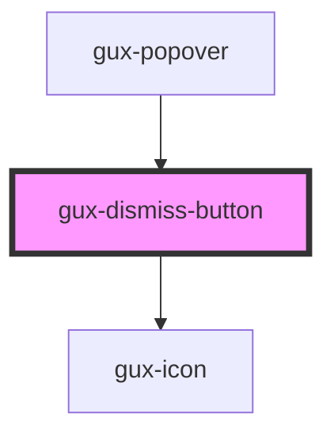

# gux-button

This custom component is a simple button having some styling on it.
You can choose between two type (secondary and primary).

<!-- Auto Generated Below -->

## Properties

| Property    | Attribute | Description               | Type                              | Default     |
| ----------- | --------- | ------------------------- | --------------------------------- | ----------- |
| `dismiss`   | --        |                           | `Function`                        | `undefined` |
| `parentObj` | --        |                           | `Object`                          | `undefined` |
| `type`      | `type`    | The component button type | `"button" \| "reset" \| "submit"` | `'button'`  |

## Events

| Event          | Description                                  | Type                  |
| -------------- | -------------------------------------------- | --------------------- |
| `dismissEvent` | Triggered when the dismiss button is pushed. | `CustomEvent<string>` |

## Dependencies

### Used by

 - [gux-popover](../../stable/gux-popover)

### Depends on

- [gux-icon](../../stable/gux-icon)

### Graph

----------------------------------------------

*Built with [StencilJS](https://stenciljs.com/)*
