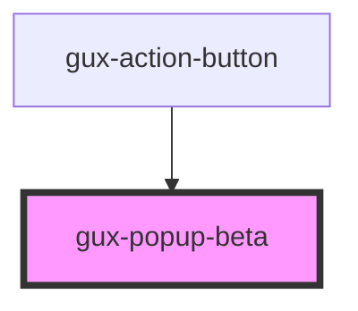

# gux-input

<!-- Auto Generated Below -->

## Properties

| Property | Attribute | Description | Type      | Default |
| -------- | --------- | ----------- | --------- | ------- |
| `open`   | `open`    |             | `boolean` | `false` |

## Slots

| Slot      | Description             |
| --------- | ----------------------- |
| `"error"` | Required slot for error |

## Dependencies

### Used by

 - [gux-action-button](../../stable/gux-action-button)

### Graph

----------------------------------------------

*Built with [StencilJS](https://stenciljs.com/)*
